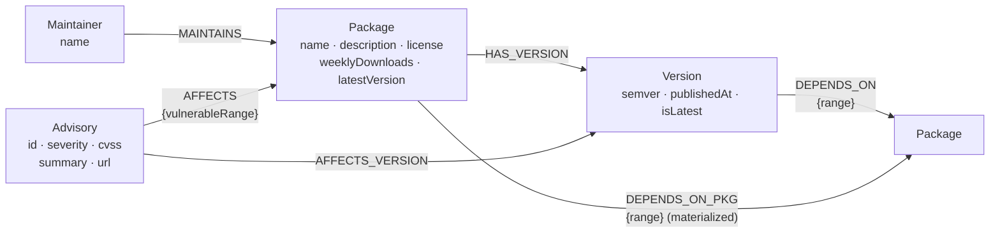
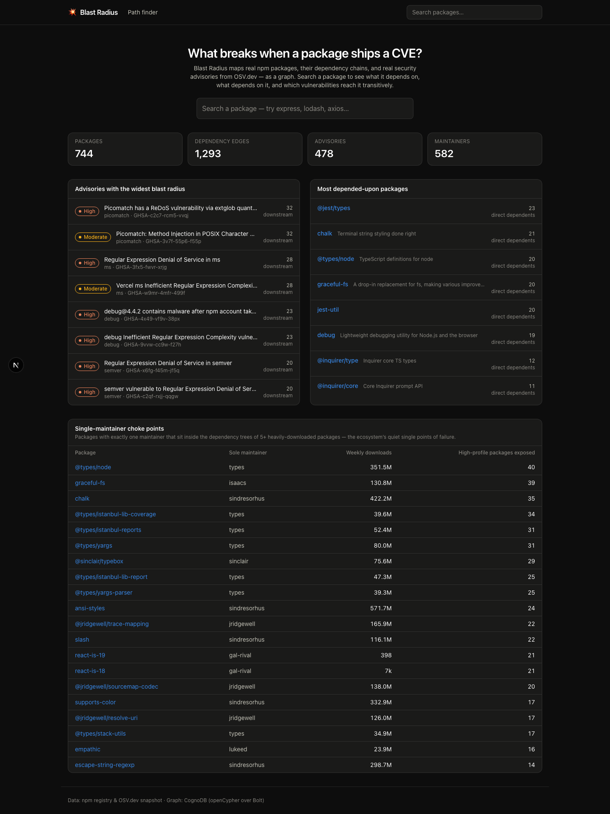
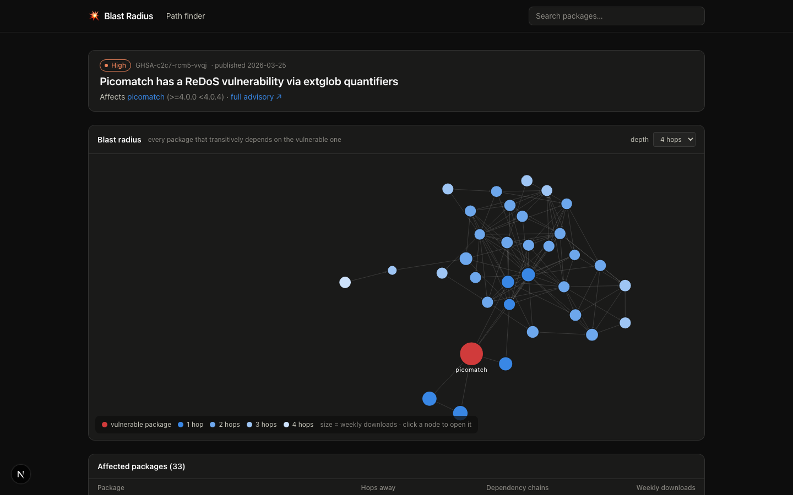
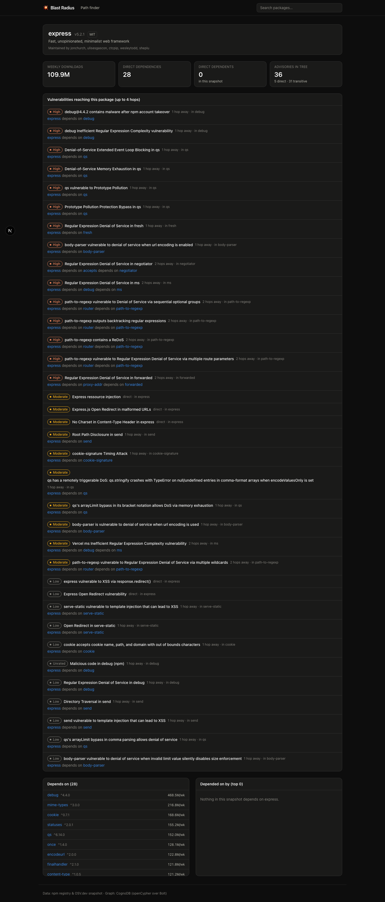
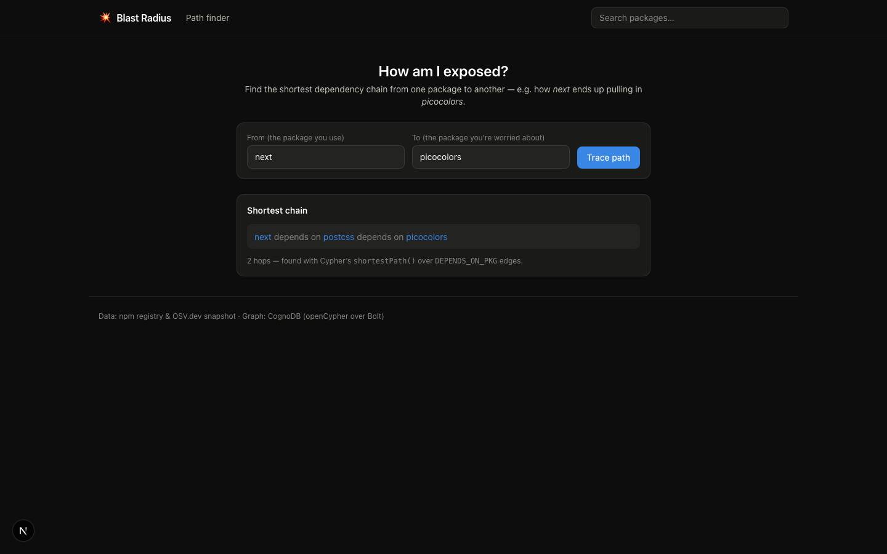
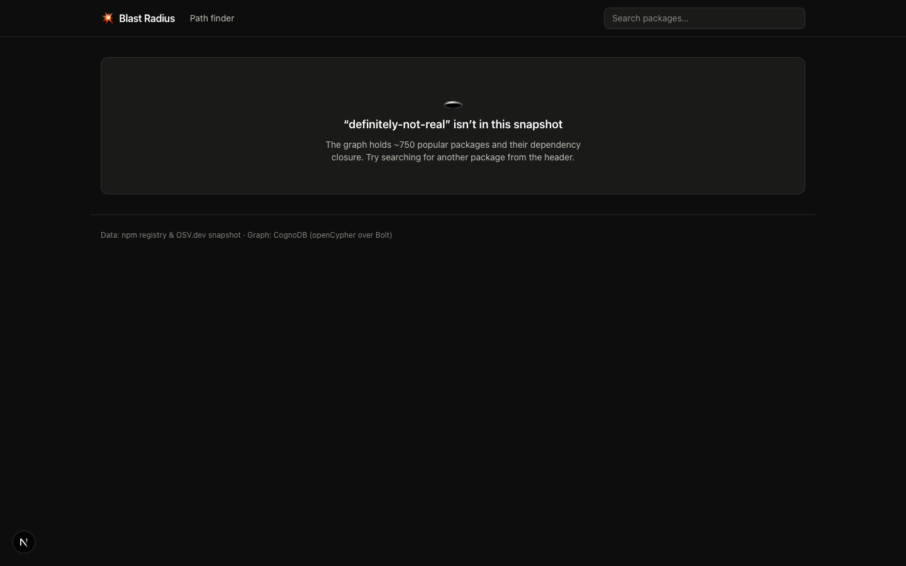

# 💥 Blast Radius

**What breaks when an npm package ships a CVE?**

Blast Radius maps real npm packages, their dependency chains, their maintainers, and real
security advisories (from [OSV.dev](https://osv.dev)) as a graph in
[CognoDB](https://console.cognodb.com), and lets anyone — including non-technical users —
explore questions like:

- *"A critical advisory just landed in `qs`. Which packages are in its blast radius, and
  through which dependency chains?"*
- *"How exactly does `next` end up pulling in `picocolors`?"*
- *"Which single-maintainer packages quietly sit inside the dependency trees of the
  ecosystem's most-downloaded software?"*
- *"Which pairs of maintainers keep showing up in the same dependency trees — so that one
  compromised account would put the same popular packages at risk?"*

> Built for the Wexa AI take-home assignment. **Live demo:** _link here_ · **Screen
> recording:** _link here_

## Why a graph database?

The interesting questions here are all about *connections*, not rows:

1. **Variable-depth traversal is the core operation.** "Everything within 4 dependency
   hops of the vulnerable package" is a recursive query. In SQL that's a recursive CTE
   that re-joins the dependency table once per hop, needs explicit cycle protection, and
   still can't naturally return the *paths* — only the set of reachable rows. In Cypher
   it's one pattern: `(vulnerable)<-[:DEPENDS_ON_PKG*1..4]-(downstream)`.
2. **Paths are the product, not a by-product.** The app's central artifact is the chain
   itself (`next → postcss → picocolors`). Cypher returns paths as first-class values
   (`nodes(path)`, `length(path)`, `shortestPath(...)`); a relational engine would need
   to reassemble chains from adjacency rows in application code.
3. **Multi-entity reachability questions compose naturally.** The "bus factor" query —
   *single-maintainer packages lying on the dependency paths of many high-download
   packages* — combines a per-node aggregate (maintainer count) with variable-length
   reachability and a path-aware group-by. As SQL, that's several recursive CTEs deep;
   as Cypher it's eight readable lines (see below).

A relational database could store this data; it can't *ask these questions* gracefully.

## Data model



- `DEPENDS_ON` keeps the semantically-precise edge (a concrete *version* depends on a
  package with a semver range).
- `DEPENDS_ON_PKG` is a **materialized package-level shortcut** derived from each
  package's latest version at seed time, so multi-hop traversals stay simple and fast on
  CognoDB's free tier.
- `Version` nodes cover each package's latest release **plus the historical releases an
  advisory actually hits** — boundary versions first (first-vulnerable, last-before-fix),
  capped per advisory and per package so the graph stays small.
- `AFFECTS_VERSION` edges are computed in the seed script by evaluating OSV's
  introduced/fixed version events against those stored versions
  ([`scripts/semver-match.ts`](scripts/semver-match.ts), shared by the fetch and seed
  steps so they cannot disagree) — semver logic stays in code, the graph stores the
  conclusion.

**Snapshot size:** 2,189 packages (137 popular seeds + their transitive dependency
closure, which exhausts at depth 5), 3,388 versions, 956 advisories — **8,069 nodes and
24,746 relationships** loaded, comfortably inside CognoDB's free c0 tier (256 MB RAM /
1 GB disk).

## Setup

### 1. Create a CognoDB instance

1. Sign up at [console.cognodb.com/signup](https://console.cognodb.com/signup) (free, no
   credit card).
2. Create a free **c0** instance and pick a region — it provisions in under a minute.
3. Copy the connection URI (`bolt+s://<instance-id>.databases.cognodb.cloud`) and the
   generated password for user `cognodb`. **The password is shown exactly once.**

### 2. Configure & seed

```bash
git clone <this repo> && cd blast-radius
npm install
cp .env.example .env       # then paste your URI and password into .env
npm run seed               # loads data/dataset.json into your instance (~1 min)
```

The committed `data/dataset.json` snapshot makes seeding fully offline and reproducible.
To refresh it from the live npm registry + OSV.dev instead: `npm run fetch-data`.

### 3. Run

```bash
npm run dev                # http://localhost:3000
```

Deploy anywhere that runs Next.js (the demo runs on Vercel's free tier) — set the same
three env vars in the host's dashboard.

## The main queries

All Cypher lives in the repository layer ([`src/repositories/`](src/repositories/)), parameterized end-to-end
through the official `neo4j-driver` — no string-built Cypher. Highlights:

**Blast radius** — the headline multi-hop traversal (up to 5 hops), with per-package hop
distance and the number of distinct chains that reach it:

```cypher
MATCH (a:Advisory {id: $id})-[:AFFECTS]->(root:Package)
MATCH path = (root)<-[:DEPENDS_ON_PKG*1..4]-(d:Package)
WITH d, min(length(path)) AS distance, count(path) AS chains
RETURN d.name, d.weeklyDownloads, distance, chains
ORDER BY distance, d.weeklyDownloads DESC
```

**Exposure chain** — the concrete answer to "how am I exposed?":

```cypher
MATCH (a:Package {name: $from}), (b:Package {name: $to})
MATCH path = shortestPath((a)-[:DEPENDS_ON_PKG*..6]->(b))
RETURN [n IN nodes(path) | n.name] AS chain
```

**Bus-factor choke points** — the query a relational database would find awkward:
single-maintainer packages inside the dependency trees of ≥ `$k` high-download packages:

```cypher
MATCH (m:Maintainer)-[:MAINTAINS]->(p:Package)
WITH p, count(m) AS maintainers WHERE maintainers = 1
MATCH (p)<-[:DEPENDS_ON_PKG*1..3]-(top:Package)
WHERE top.weeklyDownloads > $minDownloads
WITH p, count(DISTINCT top) AS exposedTop WHERE exposedTop >= $k
MATCH (only:Maintainer)-[:MAINTAINS]->(p)
RETURN p.name, only.name AS maintainer, exposedTop
ORDER BY exposedTop DESC
```

**Shared-maintainer clusters** — the choke-point query's counterpart: pairs of
maintainers whose packages keep co-occurring in the same dependency trees, so either
account being compromised puts the same popular packages in range. The pairing is the
graph doing the work — collect the maintainers reachable through each popular package's
tree, then self-join that collection:

```cypher
MATCH (root:Package) WHERE root.weeklyDownloads > $minDownloads
WITH root ORDER BY root.weeklyDownloads DESC LIMIT $roots
MATCH (root)-[:DEPENDS_ON_PKG*0..3]->(p:Package)<-[:MAINTAINS]-(m:Maintainer)
WITH root, collect(DISTINCT m.name) AS maintainers
UNWIND maintainers AS a
UNWIND maintainers AS b
WITH a, b, root WHERE a < b
WITH a, b, count(DISTINCT root) AS sharedTrees, collect(DISTINCT root.name)[0..4] AS examples
WHERE sharedTrees >= $minShared
RETURN a, b, sharedTrees, examples ORDER BY sharedTrees DESC
```

**Package health** — direct vs. transitive dependency counts and a severity histogram of
every advisory in the tree, in one round-trip. Both counts are `DISTINCT` over a
variable-length pattern (a package reached by two chains is still one dependency) — the
deduplication a recursive CTE has to hand-roll:

```cypher
MATCH (p:Package {name: $name})
OPTIONAL MATCH (p)-[:DEPENDS_ON_PKG]->(direct:Package)
WITH p, count(DISTINCT direct) AS directDependencies
OPTIONAL MATCH (p)-[:DEPENDS_ON_PKG*1..4]->(t:Package)
WITH p, directDependencies, count(DISTINCT t) AS transitiveDependencies
OPTIONAL MATCH (p)-[:DEPENDS_ON_PKG*0..4]->(dep:Package)<-[:AFFECTS]-(a:Advisory)
WITH directDependencies, transitiveDependencies, a.severity AS severity, count(DISTINCT a) AS advisories
RETURN directDependencies, transitiveDependencies,
       collect({severity: severity, count: advisories}) AS bySeverity
```

**Transitive advisories for a package** — every vulnerability reaching a package within
4 hops, with an example exposure chain per advisory (`0..4` so direct advisories are
included too):

```cypher
MATCH (p:Package {name: $name})
MATCH path = (p)-[:DEPENDS_ON_PKG*0..4]->(dep:Package)<-[:AFFECTS]-(a:Advisory)
WITH a, dep, min(length(path)) AS distance,
     [n IN nodes(head(collect(path))) | n.name] AS exampleChain
RETURN a.id, a.severity, dep.name, distance, exampleChain
```

## Architecture

Layered, constructor-injected, one responsibility per layer — routes delegate to
controllers, controllers to services, services to repositories, repositories to the
database. Any layer can be unit-tested against a fake of the layer beneath it.

```
src/models/            domain types (Package, Advisory, BlastRadius, ChokePoint, …)
src/repositories/      ALL Cypher lives here — parameterized, typed results
  PackageRepository      search · profile · dependencies · tree advisories (multi-hop) · health
  AdvisoryRepository     advisory lookup · blast-radius traversal · graph edges
  GraphRepository        stats · shortestPath · choke points · shared-maintainer clusters
src/services/          use-cases composing repositories (concurrent aggregation)
  PackageService · AdvisoryService · DashboardService · PathService
src/controllers/       HTTP layer — JSON envelope, 404/400 mapping, one 503 for DB-down
  Controller (base)      respond() / respondOr404() / badRequest()
src/lib/db.ts          Database (singleton connection manager, fail-fast config)
src/lib/container.ts   composition root — the only place the object graph is wired
src/app/api/*          Next.js route files: one-line delegations to controllers
src/app/*              UI — dashboard · package page · advisory blast-radius · path finder

scripts/fetch-data.ts  npm registry + OSV.dev  →  data/dataset.json  (committed)
scripts/semver-match.ts  shared "is this version affected?" logic (fetch + seed)
scripts/seed.ts        dataset.json  →  CognoDB  (constraints, batched UNWIND/MERGE, idempotent)
```

- **Credentials** come only from `NEO4J_URI` / `NEO4J_USER` / `NEO4J_PASSWORD` env vars
  (`.env` is git-ignored; `.env.example` documents the shape).
- **Graceful degradation:** any connectivity/auth failure surfaces as one typed 503,
  which every page renders as a friendly "can't reach the graph database" state — the
  app never shows a stack trace.
- **Free-tier awareness:** small connection pool (5), depth-clamped traversals, result
  limits, and batched seeding.

## Screenshots

| Dashboard | Blast radius |
|---|---|
|  |  |

| Package detail | Path finder |
|---|---|
|  |  |

| Empty state | Database unreachable |
|---|---|
|  |  |

## License

MIT
